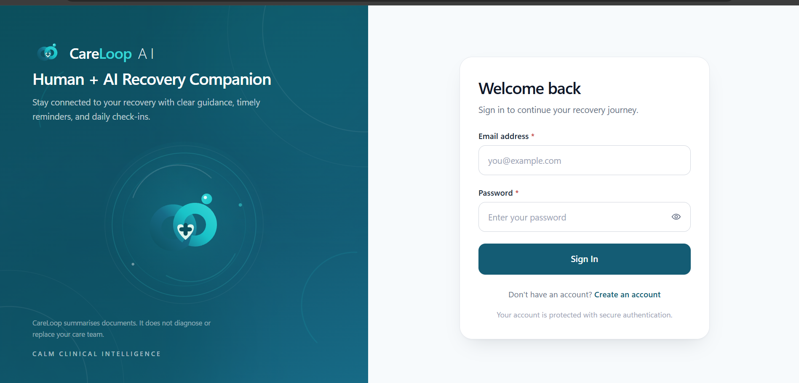

# CareLoop AI

**AI-powered post-hospital-discharge recovery and compliance assistant.**

CareLoop helps patients stay on track after leaving hospital: it reads their discharge documents, answers questions using *only* what those documents say, schedules reminders, collects daily check-ins, and escalates safely to a human when something needs attention.

> CareLoop summarises documents. It does **not** diagnose, prescribe, triage, or replace a care team.

---

## Screenshots



---

## Current Status

**Phase 7 — React Patient Frontend (Completed)**, plus self-service sign-up and sign-in.
Phase 8 (security hardening, testing, deployment) is next.

| Phase | Scope | Status |
| --- | --- | --- |
| 1 | Production backend foundation | Done |
| 2 | Discharge summary OCR + structured extraction | Done |
| 3 | Grounded RAG retrieval (ChromaDB) | Done |
| 4 | LangGraph grounded answer agent | Done |
| 5 | Scheduling and notifications | Done |
| 6 | Check-ins and safe escalation | Done |
| 7 | React patient frontend | Done |
| 8 | Security, testing, deployment | Planned |

For detailed backend setup, architecture, and testing guides, see the
👉 [Backend README](backend/README.md)

---

## Tech Stack

| Layer | Technology |
| --- | --- |
| API | FastAPI, Uvicorn |
| Database | PostgreSQL, SQLAlchemy 2, Alembic migrations |
| Validation / config | Pydantic v2, pydantic-settings, python-dotenv |
| Auth | PyJWT access tokens |
| Extraction | PyMuPDF text layer, Tesseract OCR fallback, Groq or Gemini via one `LLMProvider` interface |
| Retrieval | ChromaDB, local `BAAI/bge-small-en-v1.5` embeddings (ONNX Runtime, CPU) |
| Agent | LangGraph (fixed, acyclic graph) |
| Frontend | React, TypeScript, Vite |

---

## Project Structure

```
Care Loop AI agent/
├── backend/            FastAPI app, migrations, tests
│   ├── app/            application package (api, core, llm, rag, services, ...)
│   ├── tests/          pytest suite
│   ├── alembic.ini
│   ├── requirements.txt
│   └── .env.example    copy to .env and fill in
├── frontend/           React + TypeScript patient app
│   └── src/            api, components, features, layouts, pages, routes, styles
├── docs/
│   └── screenshots/
└── README.md
```

---

## Quick Start (Windows PowerShell)

### Backend

```powershell
cd backend

python -m venv .venv
.\.venv\Scripts\Activate.ps1
pip install -r requirements.txt

# Configure environment
copy .env.example .env      # then edit .env

# Run migrations
alembic upgrade head

# Run tests
pytest -v

# Start development server
uvicorn app.main:app --reload
```

Interactive API docs: [http://127.0.0.1:8000/docs](http://127.0.0.1:8000/docs)

### Frontend

```powershell
cd frontend

copy .env.example .env      # then edit .env
npm install
npm run dev
```

### Prerequisites

**Extraction provider (Phase 2).** Configure one provider in `backend/.env`:

```powershell
#   LLM_PROVIDER=groq
#   GROQ_API_KEY=gsk_...
```

**Tesseract (Phase 2, scanned PDFs and images only).** Tesseract is a native binary, not a pip package. Text-layer PDFs work without it; scanned PDFs and image uploads return `503` with an actionable message until it is configured.

```powershell
#   winget install UB-Mannheim.TesseractOCR
#   $env:TESSERACT_CMD="C:/Program Files/Tesseract-OCR/tesseract.exe"
```

**Embedding model (Phase 3).** The default embedder runs locally, so the weights (~127 MB) are fetched **once** as an explicit operator step. The application never downloads them at runtime, so a request can never cause a network call.

```powershell
cd backend
python -m app.rag.embeddings.fetch_model
```

After fetching, you can set `RAG_SEMANTIC_ALLOW_DOWNLOAD=false`. To skip the model entirely, set `RAG_EMBEDDING_PROVIDER=hashing` for a lexical, model-free install. The full test suite passes either way: tests use a deterministic fake provider and never download or call a network service.

### Security reminder

Never commit `.env`, `backend/storage/` (uploaded patient documents), ChromaDB data, or `.venv/`. They are covered by `.gitignore`; verify with `git status` before every push.

---

## Phase 7 at a glance — React Patient Frontend

| Concern | How it is handled |
| --- | --- |
| Stack | React + TypeScript, built with Vite |
| Authentication | Self-service sign-up and sign-in; access token held in a dedicated token store and sent by a single shared API client |
| Route protection | `RequireAuth` guard wraps every signed-in route |
| Pages | Sign in, sign up, dashboard, daily check-in, settings |
| Dashboard | Metric cards, recovery-progress card, and a warning-symptoms card |
| Patient context | An `ActivePatientProvider` scopes the UI to the patient in view |
| Safety copy | The UI states that CareLoop does not diagnose or replace the care team |
| Structure | Shared components, feature folders, layouts, and typed API models kept separate |

---

## Phase 6 at a glance — Check-ins and Safe Escalation

| Concern | How it is handled |
| --- | --- |
| Check-ins | Patients submit a daily check-in through the API and the frontend form |
| Escalation | Concerning check-in responses are flagged for a human to review |
| Judgement | The system **never decides whether a situation is an emergency**; that belongs to a clinician |
| Fail-safe | When in doubt, flag for human review rather than reassure |

### Safety boundary

Phase 6 collects what the patient reports and surfaces it to people. It does not diagnose, triage, or advise.

---

## Phase 5 at a glance — Scheduling and Notifications

| Concern | How it is handled |
| --- | --- |
| Scheduling | Reminders and appointments derived from what the discharge document already states |
| Notifications | Reminders are delivered through the notification layer |
| Source of truth | Schedules come from transcribed, clinician-written values; nothing is inferred |

---

## Phase 4 at a glance — LangGraph Grounded Answer Agent

Answer a question about one discharge document using **only** text retrieved from that document, with every source traced to a real chunk and page. A fixed, acyclic LangGraph pipeline, not an autonomous agent.

| Concern | How it is handled |
| --- | --- |
| Graph | Fixed `StateGraph` with **no cycles**; every edge is a pure function of state, and a test asserts the exact edge set so a loop cannot be added unnoticed |
| Nodes | `validate_request` → `retrieve_grounded_context` → `generate_grounded_response` → `validate_safety` → `safe_fallback` |
| State | Typed Pydantic `AgentState`; `graph.invoke()` returns a dict, so the service re-validates it into the model at the boundary |
| Grounding | The model returns **only** answer text and `cited_chunk_ids`. It is never asked for a page number |
| Provenance | Sources are resolved from **real retrieved chunks**. A model-invented chunk id resolves to nothing and is rejected; a model-invented page number is *unrepresentable* |
| Independence | `validate_safety` assumes the model **did not** comply and re-checks independently. No second LLM call |
| Reuse | Phase 3 `RagRetrievalService` and Phase 2 `LLMProvider` are used **as-is**: no second retrieval path, no new provider, no direct Chroma call |
| Tenancy | Inherited, not reimplemented: `patient_id` + `discharge_document_id` scoping and the embedding fingerprint check come from the Phase 3 service |
| Overreach | Phase 2's `has_overreach()` is called directly, plus agent-specific patterns for diagnosis, dose change, and emergency phrasing. Flagged answers are **withheld, never rewritten** |
| Fail-closed | Any doubt ⇒ `answer=null`, `supported=false`, `needs_review=true`, plus a machine-readable `safety_flags` reason |
| Stateless | No memory, no conversation history, no cross-request influence |
| Secrets & PHI | The query, retrieved text, and the answer are never logged; only counts, flags, and IDs |

### Endpoint

```
POST /api/v1/agent/query          grounded answer for one document
```

### Safety boundary

Phase 4 reports what a discharge document already says. It does not diagnose, prescribe, triage, or advise, and it never determines whether a situation is an emergency.

**What the grounding check is:** a deterministic lexical guard confirming the answer reuses the vocabulary of the passages it cites, plus a citation-authenticity check and an overreach check.

**What it is not:** not semantic entailment, not medical verification, and not proof that hallucination is impossible. A fluent sentence that reuses a cited passage's vocabulary could still pass. That is why `needs_review` is part of the contract and why any output should be read by a clinician before it reaches a patient.

`answer=null` with HTTP 200 is a **designed outcome, not an error**. Check `safety_flags` to distinguish "the document does not cover this" from "the model's answer was rejected". Real faults (no provider key, provider timeout, vector store down, wrong patient) return the same status codes as Phases 1-3 rather than being disguised as a refusal.

### Known limitations

- **Not a diagnostic or triage tool.** It answers questions about a document; it does not reason about a patient.
- Single-hop only. The agent cannot chain follow-up retrievals or ask a clarifying question; that would require a loop, which Phase 4 excludes on purpose.
- Grounding is lexical, so a faithful paraphrase using entirely different wording from the source may be withheld. This fails toward silence, which is the intended direction.
- Overreach patterns are phrase-based. Novel phrasings of a dosage change could evade them; this is a backstop, not a proof.
- The same configured LLM provider serves extraction and answers. A provider outage affects both.

---

## Phase 3 at a glance — Grounded RAG Retrieval

| Concern | How it is handled |
| --- | --- |
| Chunking | Page-scoped from the existing `--- PAGE n ---` markers; **never** spans a page, so `source_page` is exact and never guessed |
| Boundaries | Paragraph → sentence → word, with a floor that stops a snapped boundary from collapsing the forward stride |
| Verbatim text | Only the cut points are chosen; no word is rewritten, reordered, summarised, or dropped |
| Determinism | Chunk IDs are `{document_id}:{page}:{index}`; re-indexing overwrites instead of duplicating |
| Vectors | `EmbeddingProvider` abstraction; default is a real **semantic** embedder (`BAAI/bge-small-en-v1.5`, 384-d) run **locally** on CPU via ONNX Runtime. No API key, no outbound call, no PHI leaving the host |
| Storage | One ChromaDB collection; every chunk carries `patient_id` and `discharge_document_id` metadata |
| Tenancy | Mandatory `where` filter on **both** IDs on every read and delete, plus a PostgreSQL ownership check before any vector-store call |
| Not-found vs not-yours | Identical 404 body, so document IDs cannot be enumerated |
| Relevance floor | Chunks below the provider's calibrated score are dropped, so a query the document never mentions returns **empty**, not its least-unrelated passage |
| Indexing | Explicit `POST .../index`; uploading a document does **not** silently index it |
| Secrets & PHI | Query text, passages, and filenames are never logged; only counts, scores, and IDs |

### Endpoints

```
POST /api/v1/rag/retrieve                          search one document
POST /api/v1/rag/documents/{document_id}/index     index one document
```

### Safety boundary

Phase 3 **retrieves text a clinician already wrote** and stops there. There is no LLM call anywhere in `app/rag/`. The API deliberately has no `answer`, `summary`, or `recommendation` field, and a test fails if one is ever added.

A citation is only as trustworthy as its page number, which is why chunks never cross a page boundary and an unknown page is reported as `null` rather than guessed.

### Known limitations

- Semantic retrieval finds meaning, not just shared words: "blood thinner" matches a document that only says "warfarin … to thin your blood".
- The lexical `hashing` provider remains available for air-gapped installs (`RAG_EMBEDDING_PROVIDER=hashing`); it matches shared words only.
- **Do not mix providers in one index.** Vectors from different models or widths are not comparable. Changing provider or dimension means deleting `careloop_documents` and re-indexing every document.
- A query sharing only a *generic* word with the document may still be returned with a moderate score. The score is exposed to the caller rather than hidden.

---

## Phase 2 at a glance — OCR and Structured Extraction

| Concern | How it is handled |
| --- | --- |
| File validation | Extension **and** content-type **and** magic-byte sniffing; size and page limits |
| Storage | UUID filenames outside the `app/` package; the uploaded name is never used as a path |
| Traversal | `path_for()` is the only way to a path and rejects anything outside the storage root |
| Duplicates | SHA-256 unique per `(patient_id, hash)`; a duplicate returns `409` and leaves no orphan file |
| Text extraction | PyMuPDF text layer, falling back to Tesseract OCR per page |
| Structured extraction | Groq or Gemini behind one `LLMProvider` interface, at `temperature=0` |
| Safety | Values are transcribed verbatim, never inferred; placeholders become null; overreach phrasing is flagged, not rewritten |
| Audit | Every run writes an `extraction_runs` row with provider, model, and outcome |
| Secrets | API keys are never logged or returned; outgoing errors pass through redaction |

### Safety boundary

This pipeline **transcribes what a clinician already wrote**. It does not diagnose, recommend, adjust doses, or assess emergency status. Every warning symptom is stored flagged `REQUIRES REVIEW` with its source snippet so a human can verify it.

---

## Phase 1 at a glance — Backend Foundation

FastAPI application with PostgreSQL via SQLAlchemy, Alembic migrations, typed settings, JWT authentication, and a pytest suite. Every later phase builds on this foundation.

---

## Roadmap

- [x] **Phase 1** — Production Backend Foundation
- [x] **Phase 2** — Discharge Summary OCR + Extraction
- [x] **Phase 3** — Grounded RAG Retrieval (ChromaDB, retrieval only)
- [x] **Phase 4** — LangGraph Agent Workflow
- [x] **Phase 5** — Scheduling + Notifications
- [x] **Phase 6** — Check-ins + Safe Escalation
- [x] **Phase 7** — React Patient Frontend
- [ ] **Phase 8** — Security, Testing, Deployment

---

## Disclaimer

CareLoop AI is a software project that reports what a discharge document already says. It is not a medical device and does not provide medical advice. Any output should be reviewed by a qualified clinician before it reaches a patient.